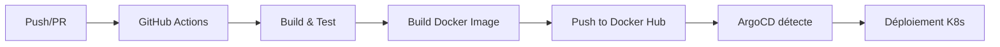

# SpringCity - API Spring Boot avec K3s, Prometheus et Grafana

[](https://github.com/axelfrache/cicd-project/actions/workflows/ci.yml)

## Présentation

SpringCity est une API REST développée avec Spring Boot permettant de gérer des informations sur des villes françaises. Ce projet démontre la mise en place d'une architecture complète incluant :

- Développement d'une API REST avec Spring Boot et Kotlin
- Stockage des données dans PostgreSQL
- Déploiement sur Kubernetes (K3s) via Helm
- Monitoring avec Prometheus et Grafana
- Intégration continue avec GitHub Actions

## Fonctionnalités

- Création et récupération d'informations sur des villes
- Exposition de métriques pour Prometheus via Spring Boot Actuator
- Monitoring complet de l'application (performances, santé, métriques métier)
- Déploiement automatisé via Helm sur K3s

## Technologies utilisées

- **Backend** : Spring Boot, Kotlin
- **Base de données** : PostgreSQL
- **Conteneurisation** : Docker, Docker Compose
- **Orchestration** : Kubernetes (K3s), Helm
- **Monitoring** : Prometheus, Grafana
- **CI/CD** : GitHub Actions

## Documentation

Pour une documentation détaillée de l'implémentation, veuillez consulter le [rapport complet](DO3-FRACHE-DESPAUX-SOULET%20Rapport%20CI_CD.pdf).

## Installation

### Prérequis

- Docker et Docker Compose
- K3s (pour le déploiement Kubernetes)
- kubectl
- Helm

### Démarrage rapide avec Docker Compose

```bash
# Cloner le dépôt
git clone https://github.com/axelfrache/cicd-project.git
cd cicd-project

# Lancer l'application avec Docker Compose
docker-compose up -d
```

L'application sera accessible à l'adresse : http://localhost:2022

### Déploiement sur K3s

```bash
# Installation de K3s
curl -sfL https://get.k3s.io | sh -

# Déploiement avec Helm
helm install springcity ./deploy/helm/springcity
```

L'application sera accessible à l'adresse : http://localhost:32022

## Monitoring

### Prometheus

Prometheus est configuré pour collecter les métriques de l'application Spring Boot via l'endpoint `/actuator/prometheus`.

Interface web : http://localhost:9090

### Grafana

Grafana est configuré pour visualiser les métriques collectées par Prometheus.

- Interface web : http://localhost:3000
- Identifiants par défaut : admin/admin
- Un dashboard préconfiguré est disponible pour surveiller :
  - Performances des API
  - Métriques JVM
  - Métriques système
  - Métriques métier

## Endpoints API

- `POST /city` : Créer une nouvelle ville
- `GET /city` : Récupérer la liste des villes
- `GET /_health` : Vérifier l'état de santé de l'application
- `GET /actuator/prometheus` : Exposer les métriques pour Prometheus

## Tests

```bash
# Exécuter les tests
mvn test
```

## CI/CD et Environnements

### Architecture des environnements

Ce projet utilise **ArgoCD** pour gérer trois types d'environnements :

1. **Production statique** (`springcity-static`)
   - Base de données PostgreSQL persistante (PVC)
   - Image Docker : `axelfrache/city-api:latest`
   - URL : `http://springcity-static.10.112.0.121.nip.io`

2. **Environnements PR éphémères** (`springcity-pr-XX`)
   - Créés automatiquement pour chaque Pull Request
   - Base de données initialisée avec un dump de production
   - Image Docker : `axelfrache/city-api:pr-XX`
   - URL : `http://pr-XX.10.112.0.121.nip.io`
   - **Supprimés automatiquement** quand la PR est fermée/mergée

### Workflow CI/CD



**Pipeline GitHub Actions :**
1. **Tests** : Exécution des tests unitaires et d'intégration
2. **Build** : Construction de l'image Docker
3. **Push** : Publication sur Docker Hub avec tags :
   - `latest` pour master
   - `pr-XX` pour les PRs

**ArgoCD :**
- Synchronisation automatique des environnements
- ApplicationSet pour les PRs (détection automatique)
- Gestion du cycle de vie complet des environnements éphémères

### Isolation des bases de données

Chaque environnement a sa **propre base de données PostgreSQL** :

- **Production** : Données persistantes (PVC)
- **PRs** : Base initialisée avec le dump de prod, données éphémères
- **Isolation totale** : Les modifications dans une PR n'affectent pas la production

### Tester l'isolation

Utilisez le script automatisé pour vérifier l'isolation :

```bash
./test-db-isolation.sh 13
```

Ce script va :
1. Vérifier l'accessibilité des environnements
2. Lister les villes initiales (dump)
3. Ajouter une ville de test dans la PR
4. Vérifier que la production n'est **pas impactée**

### Mise à jour du dump de production

Pour mettre à jour les données initiales des PRs :

```bash
# 1. Extraire les données de prod
./scripts/dump-prod-db.sh

# 2. Commiter le dump
git add deploy/helm/springcity/init-data/dump.sql
git commit -m "chore: update prod DB dump"
git push

# 3. Les nouvelles PRs utiliseront automatiquement le nouveau dump
```

Voir [DB_DUMP_WORKFLOW.md](DB_DUMP_WORKFLOW.md) pour plus de détails.

## Tester l'API

### Exemples avec curl

#### Lister les villes

```bash
# Production
curl http://springcity-static.10.112.0.121.nip.io/city | jq .

# PR #13
curl http://pr-13.10.112.0.121.nip.io/city | jq .

# Avec header Host (si problème DNS)
curl -H "Host: pr-13.10.112.0.121.nip.io" http://10.112.0.121/city | jq .
```

#### Ajouter une ville

```bash
curl -X POST http://pr-13.10.112.0.121.nip.io/city \
  -H "Content-Type: application/json" \
  -d '{
    "department_code": "34",
    "insee_code": "34172",
    "zip_code": "34000",
    "name": "Montpellier",
    "lat": 43.610769,
    "lon": 3.876716
  }' | jq .
```

#### Supprimer une ville

```bash
# Supprimer la ville avec ID 4
curl -X DELETE http://pr-13.10.112.0.121.nip.io/city/4
```

### Health check

```bash
# Vérifier l'état de santé
curl http://springcity-static.10.112.0.121.nip.io/_health

# Retourne HTTP 204 No Content si OK
```

### Scripts de test

- `test-db-isolation.sh` : Test complet d'isolation des BDD
- `pr-curl.sh` : Helper pour accéder aux PRs sans /etc/hosts
- Voir [MANUAL_TEST_GUIDE.md](MANUAL_TEST_GUIDE.md) pour les tests manuels

## Accès aux interfaces

### ArgoCD

```bash
# Port-forward vers ArgoCD
kubectl port-forward -n argocd svc/argocd-server 8080:443 &

# Récupérer le mot de passe admin
kubectl -n argocd get secret argocd-initial-admin-secret -o jsonpath="{.data.password}" | base64 -d
```

Interface : https://localhost:8080
- **User** : `admin`
- **Password** : (récupéré avec la commande ci-dessus)

### Prometheus & Grafana

Voir la section [Monitoring](#monitoring) ci-dessus.

## Variables d'environnement

L'application utilise les variables d'environnement suivantes :

- `CITY_API_ADDR` : Adresse d'écoute du serveur HTTP (défaut : 127.0.0.1)
- `CITY_API_PORT` : Port d'écoute du serveur HTTP (défaut : 2022)
- `CITY_API_DB_URL` : URL de connexion à la base de données
- `CITY_API_DB_USER` : Nom d'utilisateur pour la base de données
- `CITY_API_DB_PWD` : Mot de passe pour la base de données

## Auteurs

- Axel FRACHE
- Noa DESPAUX
- Liam SOULET